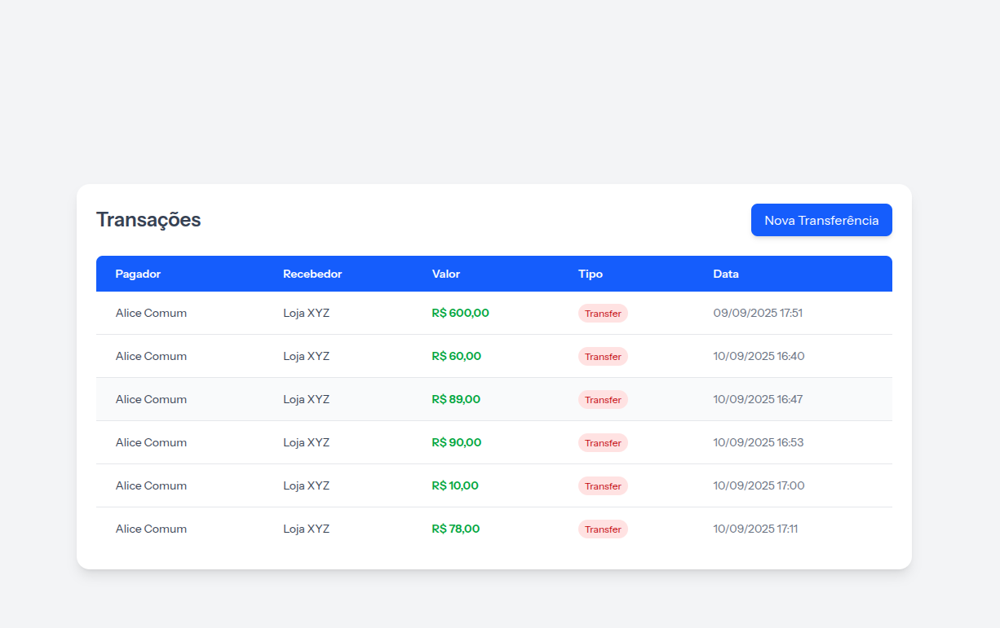
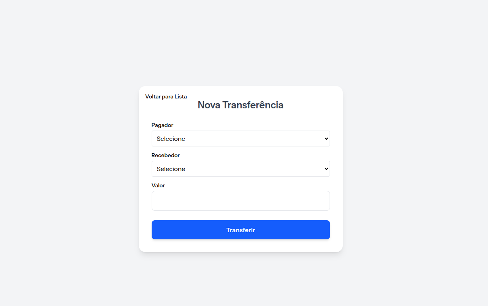

# O Jorge Transferências Light

## Tema
Plataforma simplificada de transferências entre usuários comuns e lojistas.

## Tecnologias utilizadas
- Laravel
- NodeJS
- Livewire
- Mock externo para transferências: https://util.devi.tools/api/v2/authorize
- Mock externo para notificações: https://util.devi.tools/api/v1/notify

## Funcionalidades implementadas
- [x] Cadastrar transferências
- [x] Bloquear envios para lojistas
- [x] Mensagem de sucesso de transferências
- [x] Ver transferências gerais
- [x] Envio de notificações de transferências
- [x] Bloquear envio se saldo insuficiente

## Rotas principais
- Criar transferência: `/transferencias`
- Lista de transferências: `/transferencias/lista`

## Como rodar o projeto
1. Clonar o repositório.
2. Rodar `composer install` e `npm install`.
3. Configurar `.env`.
4. Rodar migrations e seeders: `php artisan migrate --seed`.
5. Para testar saldo dos usuários, usar Tinker:
```bash
php artisan tinker
User::find(1)->wallet()->update(['balance' => 1000]);
User::with('wallet')->get()->map(fn($u) => [$u->id, $u->wallet->balance ?? 0]);

Imagens / Capturas

Lista de transferências

Formulário de criação de transferência



